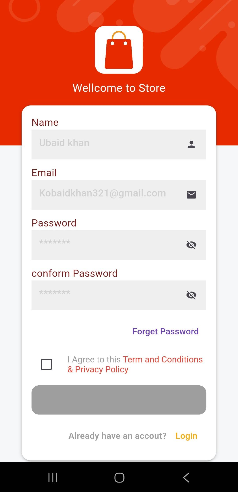
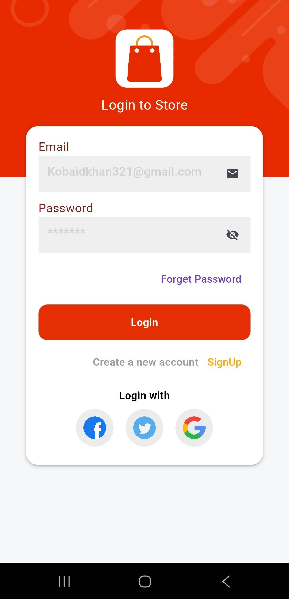
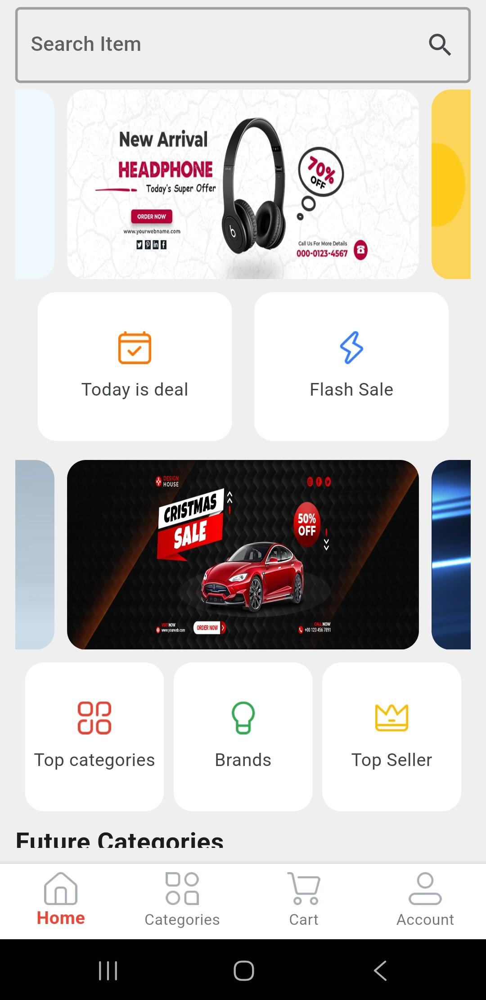
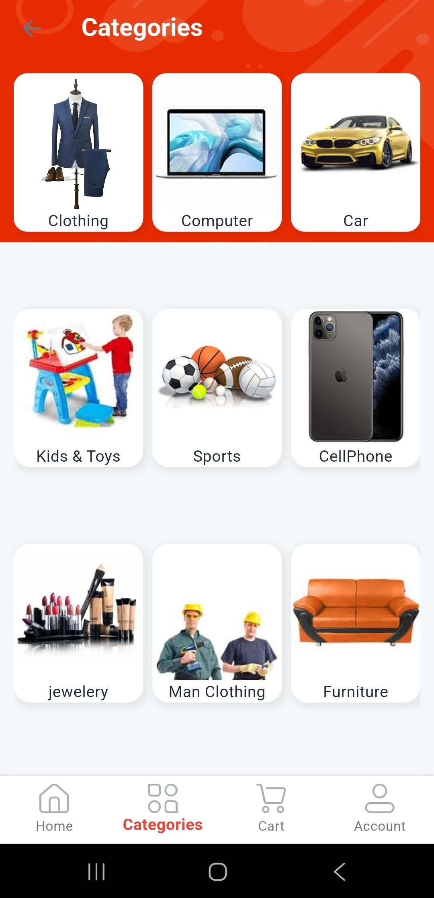
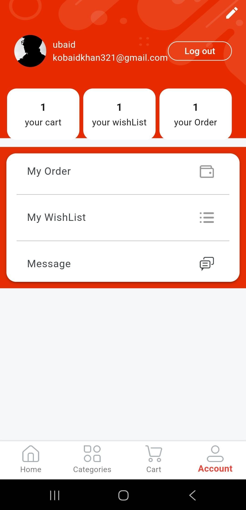
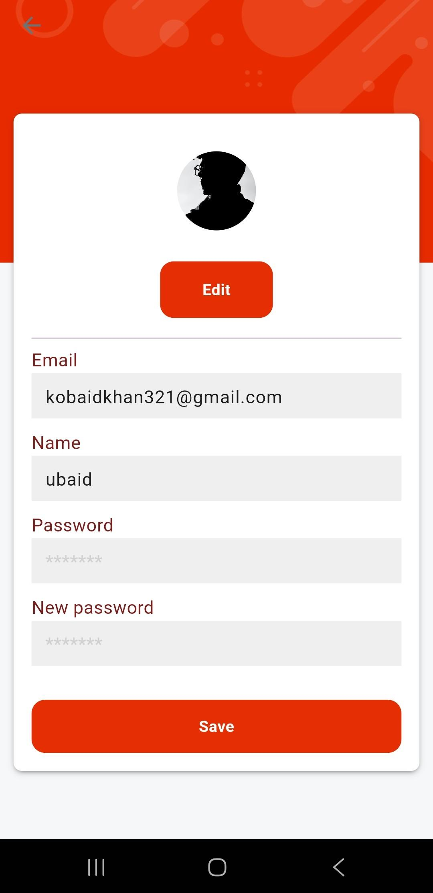

## Ecommerce App
- An order booking Flutter application built using GetX + MVVM architecture with Firebase authentication, allowing users to manage - products, categories, and orders with persistent login support.
---
## 🚀 Features.
- ## 🔐 *Authentication*
- User sign up and login using Firebase
- Persistent login session (user remains logged in)
- Secure and reliable authentication flow
- ## 📦 *Product & Category*
- View all products
- Browse products by categories
- Apply category-based filters
- Optimized UI for smooth navigation
- ## 🛒 *Order Management*
- Create and manage orders
- Seamless ordering experience
- Supports offline functionality
- ## 👤 *User Profile*
View profile details
Edit and update user information
- ## ⚡ *Architecture*
- GetX for state management
- Clean and scalable MVVM architecture
- Proper separation of concerns for maintainability
## 🛠️ *Tech Stack*
- Flutter
- Dart
- GetX
- Firebase Authentication
- Firebase Firestore / Realtime Database / Firebase Storage
- Local Storage SharedPreferences

<table align="center">
  <tr>
    <td align="center">
       
      <b>Register</b>
    </td>
    <td align="center">
       
      <b>Login</b>
    </td>
    <td align="center">
       
      <b>Home</b>
    </td>
   
  </tr>

  
  <tr>
      <td align="center">
       
      <b>Category</b>
    </td>
    <td align="center">
       
      <b>Profile</b>
    </td>
    <td align="center">
       
      <b>Edit_Profile</b>
    </td>
  </tr>
</table>
